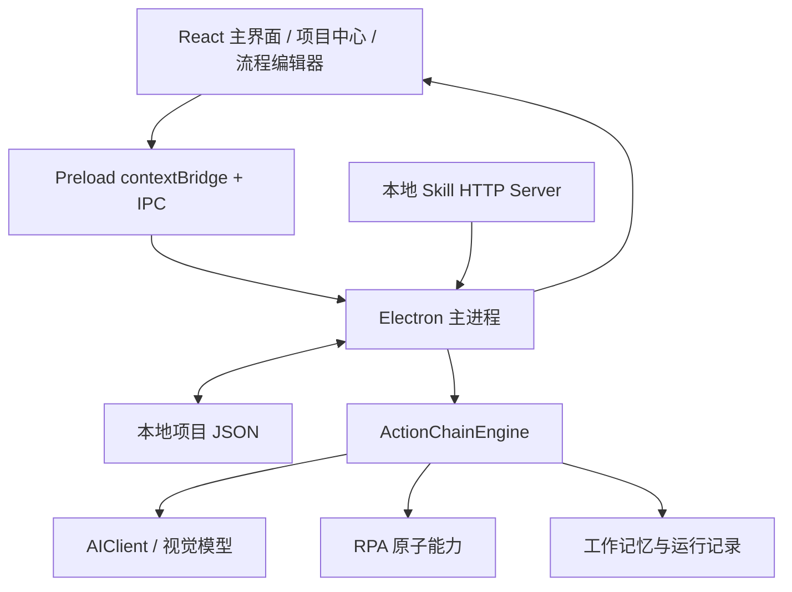

# Kuangye 通用视觉智能体底座

> 让 AI 看懂屏幕、理解上下文、执行操作、从经验中学习。适用于任何桌面应用场景。

## 项目定位

Kuangye 是一个基于 Electron、React 和 TypeScript 的**通用视觉智能体底座**。它通过视觉模型（VLM）理解桌面环境，像人类一样操作任意 GUI 应用——不限于特定软件，不限于特定场景。

当前仓库以 Windows 作为主要开发和验证平台；项目已经配置 macOS 打包目标和对应的平台分支，但 macOS 的完整运行效果需要在 macOS 实机上进一步验证。

### 核心能力

- **视觉感知**：VLM 识别界面元素、理解当前状态、定位操作目标
- **智能决策**：根据上下文和经验，规划下一步操作
- **精准执行**：鼠标点击、键盘输入、拖拽操作、快捷键等 RPA 原子能力
- **经验积累**：工作记忆系统记录每次执行，归纳可复用的操作经验

## 致谢

本项目基于 [SightFlow Desktop Agent](https://github.com/sightflow-dev/sightflow-desktop-agent) 改进而来。感谢 SightFlow 团队（[sightflow.dev](https://sightflow.dev)）的开创性工作，为本项目奠定了坚实的基础。

## 核心能力

### 可视化动作链编辑器

项目以 ActionChain 为核心，将截图、窗口查找、鼠标键盘输入、像素比较、模板匹配和 AI 坐标转换等桌面能力组合成可视化自动化流程。

编辑器位于 src/renderer/src/flow-editor/，支持：

- 从步骤面板添加节点；
- 拖动节点、平移和缩放画布；
- 从节点端口创建连线；
- 编辑节点参数、条件、超时、重试和错误处理；
- 为 if_else 配置真 / 假分支；
- 为 random_branch 配置带权重的随机路线；
- 复制、粘贴、删除节点，撤销和重做；
- 运行前校验流程图；
- 单独运行当前链，或启动全局监听。

### 支持的节点类型

| 分类       | 节点                                                                    |
| ---------- | ----------------------------------------------------------------------- |
| 鼠标操作   | 点击、右键点击、拖动、随机鼠标移动                                      |
| 键盘操作   | 输入文字、按键、组合键                                                  |
| 流程控制   | 等待、条件分支、随机分支、跳转、调用动作链                              |
| 窗口与坐标 | 刷新窗口锚点、定位 UI 区域、AI 视觉定位                                 |
| 截图与检测 | 截图给 AI、检测像素变化、等待像素变化、检测红点、等待红点、设置像素基线 |
| AI 执行    | 执行 AI 动作计划                                                        |

### 双捕获策略

- **VLM 自动检测**：视觉模型自动识别界面元素，适用于有明确 UI 结构的应用
- **框选器人工指定**：用户自由绘制区域，适用于任何桌面应用

### 工作记忆系统

- **TraceRecorder**：记录完整的操作轨迹（截图 + 推理 + 动作 + 结果）
- **ExperienceStore**：从轨迹中归纳可复用的操作经验（场景 / 指导 / 原因）
- **经验注入**：运行时自动注入相关经验，提升决策质量

## 实现原理



### Renderer、Main 和 IPC

src/renderer/src/App.tsx 负责主界面、设置、运行状态和日志。src/renderer/src/flow-editor/ 下的 ProjectLibrary、FlowEditor、StepInspector、flow-geometry、undo-redo 和 serial-task-queue 共同构成项目中心与编辑器。

编辑器不直接访问文件系统，而是通过 preload 暴露的 IPC 请求主进程加载和保存项目。src/main/index.ts 集中处理窗口、项目 CRUD、overlay、ActionChainEngine 生命周期、日志广播、Provider 和 Skill Server。

### ActionChainEngine：事件循环和图执行

src/core/action-chain/engine.ts 是运行核心。启动时它读取工作区，初始化变量、像素基线、窗口缓存和触发器，然后通过定时器轮询启用的执行链。

进入流程后，引擎从唯一入口节点开始，按连线执行节点。条件节点选择真 / 假路线，随机节点按权重选路，call_chain 调用可复用子流程。每个节点都有超时、重试、最大失败次数和 onError 策略，可以继续、停止或跳转。

### 坐标和视觉模型

区域在编辑阶段保存为逻辑屏幕坐标。运行阶段可以根据窗口标题、进程名和所有者重新解析窗口，使用窗口锚点计算区域偏移，通过模板匹配或 AI 重新定位 UI，并在截图和 RobotJS 输入之间处理 scaleFactor。

src/core/ai-client.ts 封装 OpenAI 兼容的 /chat/completions 请求：请求包含 system prompt、用户提示和 base64 图片，默认关闭 thinking 并设置 30 秒超时。视觉定位、截图分析和连接测试共用这一客户端。

### 工作记忆与审计

src/core/work-memory/ 保存 RunSession、RunStep 和 ExperienceCard。记录项目、链、时间、状态、耗时、变量、截图、AI prompt、原始响应、解析结果、动作坐标、文本、按键和原因。

记录默认写入 Electron userData，不依赖外部数据库。运行记录和截图可能包含敏感信息，使用时应保护本机数据目录。

### Overlay 框选器

src/main/action-chain-overlay.ts 与 src/renderer/overlay/ActionChainOverlayApp.tsx 提供透明全屏框选层，支持多区域、命名、窗口锚点、模板图片和桌面操作模式，并使用 wizardId 防止前一轮窗口的延迟 IPC 影响新一轮框选。

## 本地运行

环境要求：Windows + Node.js LTS + npm。macOS 也提供打包配置，但需要在 macOS 实机安装依赖并验证窗口查找、屏幕录制、辅助功能和 RobotJS 输入权限。使用 AI 节点时还需要火山方舟兼容接口 API Key。

PowerShell：

```powershell
npm install
npm run dev
npm run typecheck
npm run build
npm run build:win
```

项目也提供 npm run build:mac 和 npm run build:linux 命令。macOS 打包命令已配置，但本仓库当前开发环境未对 macOS 安装包做实机验证。项目没有统一测试框架，主要通过 ts-node 运行 scripts/ 下的独立验证脚本，例如：

```powershell
npm run test:action-chain-validation
npm run test:condition-utils
npm run test:template-utils
npm run test:wait-utils
npm run test:random-branch
npm run test:random-mouse
npm run test:ai-action-coordinates
npm run test:text-input-chunks
npm run test:serial-task-queue
npm run test:flow-geometry
```

真实鼠标、窗口或视觉模型相关验证需要合适的桌面环境，不能只靠类型检查证明行为正确。

## 使用流程

1. 启动应用，进入动作链项目中心；
2. 新建项目；
3. 使用"框选区域"在目标软件上绘制区域；
4. 配置窗口锚点或模板图片；
5. 新建执行链，添加节点并连线；
6. 将可复用步骤抽成动作链，用 call_chain 调用；
7. 为 AI 节点填写提示词、输出模式、变量名和安全阈值；
8. 保存项目并查看运行前校验；
9. 先运行本链验证，再运行全局启动项目监听；
10. 在工作记忆窗口查看步骤日志、AI 输出、动作坐标和结果。

第一次运行真实流程时，建议先用等待、截图、像素检测和低风险点击小范围验证，再加入输入、发送、拖动或 AI 动作。

## Provider 扩展

Provider 是项目的模型服务扩展机制。每个 Provider 由 manifest 和 bundle 组成：

- src/main/provider-bundle.ts：读取 manifest、校验配置、安装和加载 bundle；
- resources/providers/volcengine-ark/：内置火山方舟 Provider 示例；
- docs/provider.md：Provider manifest、createProvider(context) 和事件格式；
- 设置页：展示 Provider 配置字段、保存 API 配置和切换服务。

Provider 可以接收截图、应用类型、文本和工作记忆信息，并通过 thinking、reply_text、skip、error 等事件返回处理结果。ActionChain 的视觉节点则直接通过 AIClient 调用视觉模型完成区域识别、结构化分析和动作规划。

## Skill HTTP API

应用内置只监听本机回环地址的 HTTP 服务：

```text
GET  http://127.0.0.1:12680/skill/status
POST http://127.0.0.1:12680/skill/start
POST http://127.0.0.1:12680/skill/pause
```

12680 被占用时会尝试 12681。服务只监听 127.0.0.1，不会直接暴露到局域网。接口有并发保护，调用后应再次查询 status。错误码见 skills/kuangye-agent/SKILL.md。

## 目录说明

```text
src/
├─ main/                         Electron 主进程、IPC、窗口、引擎生命周期
├─ preload/                      contextBridge，向渲染器暴露受控 IPC
├─ renderer/
│  ├─ src/                       React 主界面、设置、项目中心、工作记忆
│  └─ overlay/                   透明框选器与紧凑运行控制器
└─ core/
   ├─ action-chain/              数据模型、执行引擎、校验、存储、AI 模板
   ├─ rpa/                       截图、窗口、输入、像素、模板匹配
   ├─ work-memory/               运行会话、轨迹、经验卡片
   ├─ ai-client.ts               视觉模型客户端
   └─ session-types.ts           Provider 输入输出类型

resources/providers/             Provider manifest 和 bundle 示例
docs/                             Provider、设计和路线文档
scripts/                          开发启动与独立验证脚本
build/                            Electron 图标和打包资源
```

## 当前边界

- 点击、输入和 AI 动作都可能改变真实应用状态，请先在低风险环境测试；
- 视觉模型返回的区域和动作不是绝对可靠的，安全检查不能代替人工确认；
- 窗口标题、DPI、应用主题、动画和权限变化都可能影响坐标、模板匹配和像素检测；
- 默认模型、Base URL 和部分 AI 协议仍由代码配置，不是完全可视化的模型管理系统；
- 运行记录和截图可能包含敏感信息，项目默认使用本地文件保存，需要自行保护；
- Windows 是当前主要验证平台；macOS 目前属于已配置构建目标，不能仅凭代码分支和打包配置视为已完成实机验证；
- 文档和源码持续演进，当前产品行为应以源码、package.json 和本 README 为准。

## 开发约定

- 业务逻辑优先放在 src/core/，不要把引擎逻辑写进 React 组件；
- 主进程负责文件、窗口、原生输入和 AI 客户端；
- Renderer 通过 preload / IPC 与主进程通信，不直接访问 Node.js 能力；
- 新增节点时同步更新类型、标签、参数面板、引擎执行分支、校验规则和测试；
- 修改坐标逻辑时同时考虑逻辑屏幕坐标、窗口锚点、截图 scale factor 和 RobotJS 输入坐标；
- 修改保存结构时同步更新项目级 JSON 迁移逻辑。

## 相关文档

- Provider 接入文档：docs/provider.md
- 产品路线图：docs/ROADMAP.md
- 设计规格：docs/DESIGN-SPEC.md
- Kuangye Agent Skill：skills/kuangye-agent/SKILL.md

## 开源协议

本项目采用 Apache License 2.0 开源。
